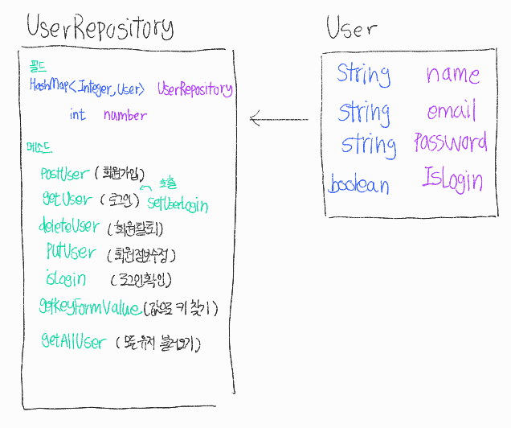

### [0408 유저](https://github.com/heeeesoo/JAVA_PDA/blob/main/src/day0408/MiniProj.java)

#### 구현 과제
1. 회원가입
2. 로그인
3. 회원정보 수정
4. 탈퇴

#### 클래스
1. User <br/>
   a. 필드 : name, email, password <br/>
   b. 메소드 : 
      - boolean equals(Object o) : 같으면 true, 다르면 false
      - String toString() : User 객체 값 출력
   <br/>
2. UserRepository <br/>
   a. 필드 -number : map에 넣을 key 값
     <br/>
   b. 메소드 : <br/>
     - void setUserLogin(User user) : user login true로 바꾸기
     - void getAllUser() : user 정보 다 출력하기
     - void postUser(User user) : userRepository에 user 추가하기
     - void getUser(User user) : 해당 user 있으면 true 출력, 없으면 false 출력
     - void deleteUser(User user) : 해당 user userRepository에 삭제
     - void putUser(User user, String name, String email, String password) : 해당 user의 email, password 수정
     - boolean isLogin(User user) : 해당 user 로그인했으면 true 반환, 아니면 false 반환




#### 출력 결과
```
기능을 입력해주세요: 1
입력한 기능: 1
회원가입
이름을 입력해주세요: 
test
이메일을 입력해주세요: 
email
비밀번호를 입력해주세요: 
pwd
0: Name: test, Email: email, Password: pwd, Login:false
기능을 입력해주세요: 2
입력한 기능: 2
로그인
이메일을 입력해주세요: 
email
비밀번호를 입력해주세요: 
pwd
로그인 성공
0: Name: test, Email: email, Password: pwd, Login:true
기능을 입력해주세요: 3
입력한 기능: 3
회원정보 수정
수정하고 싶은 회원의 이메일을 입력해주세요: 
email
수정하고 싶은 회원의 비밀번호를 입력해주세요: 
pwd
새로운 이름을 입력해주세요: 
test2
새로운 이메일을 입력해주세요: 
email2
새로운 비밀번호를 입력해주세요: 
pwd2
put:0
0: Name: test2, Email: email2, Password: pwd2, Login:false
수정 완료 다시 로그인해주세요.
기능을 입력해주세요: 2
입력한 기능: 2
로그인
이메일을 입력해주세요: 
email2
비밀번호를 입력해주세요: 
pwd2
로그인 성공
0: Name: test2, Email: email2, Password: pwd2, Login:true
기능을 입력해주세요: 4
입력한 기능: 4
회원 탈퇴
이메일을 입력해주세요: 
email2
비밀번호를 입력해주세요: 
pwd2
탈퇴 성공
기능을 입력해주세요: 0
입력한 기능: 0
```

---

### [0404 mini hw](https://github.com/heeeesoo/JAVA_PDA/blob/main/src/day0404/MiniHW.java)

#### 클래스
1. Person
2. SmartPhoneType
3. SamsungPhone
4. ApplePhone

#### 상속 관계
부모 : SmartPhoneType
<br/>
자식 : SmartPhoneType, ApplePhone

#### 메소드
1. Person :<br/>
   - talk : 말하기<br/>
   - getName : name 반환<br/>
   
2. SmartPhoneType :<br/>
   - turnOn : 핸드폰 켜기<br/>
   - ring : 폰 울리는 소리 출력<br/>

5. SamsungPhone, ApplePhone:<br/>
   - ring : 폰 울리는 소리 오버라이딩<br/>

#### 출력 결과
```
가나다 : 야 나 내 핸드폰 켜볼게
가나다폰 : 삐비빅
라마바 : 나도 핸드폰 켜볼게
라마바폰 : bbeep
```